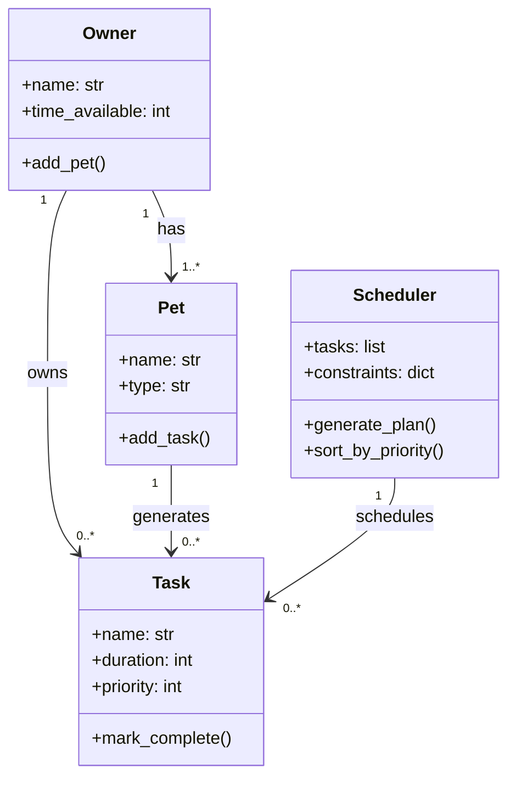

# PawPal+ Project Reflection

## 1. System Design

**a. Initial design**

Three core actions a user should be able to perform:

1. Enter owner and pet info (name, pet type, preferences)
2. Add or edit tasks (e.g. walk, feeding, meds) with duration and priority
3. Generate and view a daily care plan with reasoning

Main building blocks:

- Owner: holds name and time available. Can add a pet and set preferences.
- Pet: holds name, type, and age. Can add tasks.
- Task: holds name, duration, and priority. Can be marked complete.
- Scheduler: holds list of tasks and constraints. Can generate and sort the daily plan.

I designed four classes: Owner stores the user's name and available time.
Pet stores the animal's name and type. Task stores a care activity with
duration and priority. Scheduler takes a list of tasks and generates a
sorted daily plan based on priority.

**b. Design changes**

**b. Design changes**

I updated generate_plan() to filter tasks by time_available.
The original version just sorted tasks without checking if they fit
in the owner's available time. This was a logic gap spotted during review.

---

## 2. Scheduling Logic and Tradeoffs

**a. Constraints and priorities**

My scheduler considers time available and task priority.
I chose time as the main constraint because a busy owner
can't do everything. Priority decides the order so the
most important tasks happen first.

**b. Tradeoffs**

My scheduler only checks for exact name matches as conflicts, not
overlapping durations. This keeps the logic simple and avoids crashes,
but means two different tasks at the same time won't be flagged.
This is reasonable for a basic pet care app where simplicity matters.

---

## 3. AI Collaboration

**a. How you used AI**

- How did you use AI tools during this project (for example: design brainstorming, debugging, refactoring)?
- What kinds of prompts or questions were most helpful?

**b. Judgment and verification**

- Describe one moment where you did not accept an AI suggestion as-is.
- How did you evaluate or verify what the AI suggested?

---

## 4. Testing and Verification

**a. What you tested**

- What behaviors did you test?
- Why were these tests important?

**b. Confidence**

- How confident are you that your scheduler works correctly?
- What edge cases would you test next if you had more time?

---

## 5. Reflection

**a. What went well**

- What part of this project are you most satisfied with?

**b. What you would improve**

- If you had another iteration, what would you improve or redesign?

**c. Key takeaway**

- What is one important thing you learned about designing systems or working with AI on this project?
