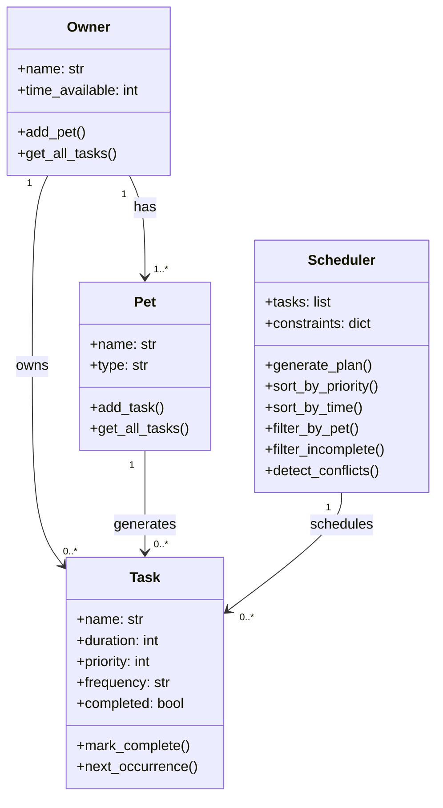

# PawPal+ Project Reflection

## 1. System Design

**a. Initial design**

Three core actions a user should be able to perform:

1. Enter owner and pet info (name, pet type, preferences)
2. Add or edit tasks (e.g. walk, feeding, meds) with duration and priority
3. Generate and view a daily care plan with reasoning

Main building blocks:

- Owner: holds name and time available. Can add a pet and set preferences.
- Pet: holds name, type, and age. Can add tasks.
- Task: holds name, duration, and priority. Can be marked complete.
- Scheduler: holds list of tasks and constraints. Can generate and sort the daily plan.

I designed four classes: Owner stores the user's name and available time.
Pet stores the animal's name and type. Task stores a care activity with
duration and priority. Scheduler takes a list of tasks and generates a
sorted daily plan based on priority.

**b. Design changes**

I updated generate_plan() to filter tasks by time_available.
The original version just sorted tasks without checking if they fit
in the owner's available time. This was a logic gap spotted during review.

---

## 2. Scheduling Logic and Tradeoffs

**a. Constraints and priorities**

My scheduler considers time available and task priority.
I chose time as the main constraint because a busy owner
can't do everything. Priority decides the order so the
most important tasks happen first.

**b. Tradeoffs**

My scheduler only checks for exact name matches as conflicts, not
overlapping durations. This keeps the logic simple and avoids crashes,
but means two different tasks at the same time won't be flagged.
This is reasonable for a basic pet care app where simplicity matters.

---

## 3. AI Collaboration

**a. How you used AI**

I used Claude throughout this project for design brainstorming, writing
class skeletons, debugging indentation errors, and refactoring code.
The most helpful prompts were specific ones like "add conflict detection
to my Scheduler class" rather than vague ones.

**b. Judgment and verification**

When Claude suggested the generate_plan() method, I verified it by
running main.py and checking that Playtime was correctly skipped due
to the time constraint. I didn't accept it blindly — I traced through
the logic myself first.

---

## 4. Testing and Verification

**a. What you tested**

I tested task completion, task addition to a pet, sorting by duration,
daily recurrence logic, and conflict detection. These were important
because they cover the core scheduling behaviors the app depends on.

**b. Confidence**

I am 4/5 confident the scheduler works correctly. Edge cases I would
test next include: an owner with zero time available, a pet with no
tasks, and two pets with tasks of the same name.

---

## 5. Reflection

**a. What went well**

I am most satisfied with the scheduling logic. The generate_plan()
method correctly filters by time and sorts by priority, which makes
the output feel genuinely useful.

**b. What you would improve**

I would add a start time field to Task so the schedule shows exact
times like "9:00 AM - Walk (20 mins)" instead of just a list.

**c. Key takeaway**

I learned that designing the system on paper first (UML) made the
coding much easier. AI tools are most useful when you already
understand the structure — they speed up implementation but can't
replace the design thinking.